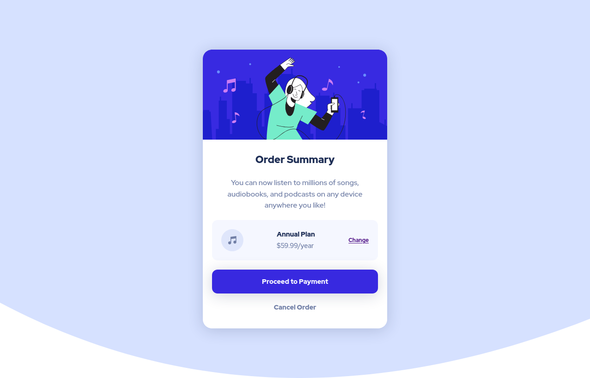

# Frontend Mentor - Order summary card solution

This is a solution to the [Order summary card challenge on Frontend Mentor](https://www.frontendmentor.io/challenges/order-summary-component-QlPmajDUj). Frontend Mentor challenges help you improve your coding skills by building realistic projects.

## Table of contents

- [Frontend Mentor - Order summary card solution](#frontend-mentor---order-summary-card-solution)
  - [Table of contents](#table-of-contents)
  - [Overview](#overview)
    - [The challenge](#the-challenge)
    - [Screenshot](#screenshot)
    - [Links](#links)
  - [My process](#my-process)
    - [Built with](#built-with)
    - [What I learned](#what-i-learned)
    - [Continued development](#continued-development)
      - [For this project](#for-this-project)
  - [Author](#author)

## Overview

### The challenge

Users should be able to:

- See hover states for interactive elements

### Screenshot

### Links

- Solution URL: [Add solution URL here](https://www.frontendmentor.io/solutions/mobile-first-solution-using-flexbox-and-custom-properties-ZIMLMkpI8-)
- Live Site URL: [View live demo](https://alinmercasi.github.io/order-summary-component-main/)

## My process

### Built with

- Semantic HTML5 markup
- CSS custom properties
- Flexbox
- Mobile-first workflow

### What I learned

- It helped me to understand better flexbox
- I understood that custom properties can be live saving :)
- I have grasped the idea of mobile first principle

### Continued development

- To step into more advanced concepts of flexbox and grid
- To deepen my knowledge of semantic HTML5 markup
- An off course, practice, practice, practice :)
  #### For this project
  - I would like to add some micro interactions with javascript

## Author

- Alin Mercasi
- Frontend Mentor - [@alinmercasi](https://www.frontendmentor.io/profile/alinmercasi)
